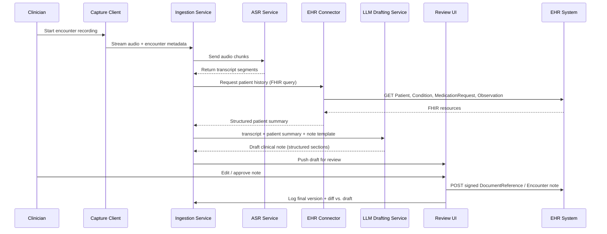

# Banner Health — Reducing Physician Burnout at Scale

## 1. Overview

| | |
|---|---|
| **Vendor / Deployer** | Banner Health |
| **Problem** | Physicians spend a disproportionate share of their day on documentation (chart notes, after-visit summaries, record review) rather than direct patient care, driving burnout. |
| **Solution** | An AI clinical assistant that drafts documentation and summarizes patient records during and after encounters, so physicians spend less time on paperwork. |
| **Reported Outcome** | Meaningful reduction in documentation burden / burnout drivers at health-system scale. |
| **Primary Users** | Physicians, advanced practice providers, care teams. |

> **Disclaimer:** Banner Health's actual internal architecture is not publicly disclosed. The HLD/LLD below is an **illustrative, inferred design** based on common patterns for ambient clinical documentation and EHR-summarization systems. It is intended for architectural learning/discussion, not as a factual account of Banner Health's real system.

---

## 2. High-Level Design (HLD)

### 2.1 System Context Diagram

```mermaid
flowchart LR
    Clinician[Physician / Care Team]
    Mic[Ambient Capture\n(mic / dictation app)]
    Gateway[API Gateway /\nAuth (OAuth2, SMART on FHIR)]
    Ingest[Encounter Ingestion Service]
    ASR[Speech-to-Text Service]
    LLM[Clinical LLM Drafting Service]
    Summ[Record Summarization Service]
    Review[Clinician Review UI]
    EHR[(EHR System\ne.g. Cerner / Epic)]
    Store[(Encounter & Draft\nData Store)]
    Audit[(Audit / Compliance Log)]

    Clinician -->|Speaks during visit| Mic
    Mic --> Gateway
    Gateway --> Ingest
    Ingest --> ASR
    ASR --> LLM
    Ingest -->|Pulls chart history| EHR
    EHR --> Summ
    Summ --> LLM
    LLM --> Store
    LLM --> Review
    Review -->|Edits & approves| Clinician
    Review -->|Signed note| EHR
    Ingest --> Audit
    LLM --> Audit
```

### 2.2 Component Overview

| Component | Responsibility | Key Tech Choice |
|---|---|---|
| Ambient Capture Client | Captures audio/dictation at point of care | Mobile/desktop app, WebRTC or native audio SDK |
| API Gateway / Auth | AuthN/AuthZ, routing, rate limiting | OAuth2, SMART on FHIR scopes, API gateway (e.g., Kong/Envoy) |
| Encounter Ingestion Service | Normalizes incoming audio + metadata into an encounter record | Event-driven microservice (Kafka/SQS-backed) |
| Speech-to-Text (ASR) | Converts ambient audio to transcript | Medical-tuned ASR model |
| Record Summarization Service | Pulls and condenses relevant patient history from EHR | FHIR client + retrieval pipeline |
| Clinical LLM Drafting Service | Generates draft note (SOAP/HPI format) from transcript + history | LLM (e.g., Claude) with clinical prompt templates |
| Clinician Review UI | Presents draft for edit/approve/reject | Web app embedded in or adjacent to EHR |
| Encounter & Draft Data Store | Persists transcripts, drafts, edit history | Encrypted relational/document store |
| Audit / Compliance Log | Immutable trail of AI-generated vs. human-edited content | Append-only log store |

### 2.3 Non-Functional Requirements

- **Compliance:** HIPAA-compliant data handling; PHI encrypted in transit (TLS 1.2+) and at rest (AES-256); BAA with all vendors in the pipeline.
- **Human-in-the-loop:** No AI-drafted note is finalized/submitted to the EHR without explicit clinician review and sign-off.
- **Latency:** Draft note available within seconds to a few minutes after encounter ends (near-real-time, not necessarily live).
- **Availability:** High availability during clinic hours (e.g., 99.9%) with graceful degradation to manual documentation if the service is down.
- **Scalability:** Must handle concurrent encounters across many providers/facilities within a health system.

---

## 3. Low-Level Design (LLD)

### 3.1 Data Flow — "Encounter to Signed Note"



### 3.2 Key Data Models

```
Encounter
  id: UUID
  patient_id: string (FHIR Patient reference)
  provider_id: string
  started_at: timestamp
  ended_at: timestamp
  status: enum [in_progress, transcribed, drafted, reviewed, signed]

TranscriptSegment
  id: UUID
  encounter_id: UUID (FK)
  sequence: int
  text: string
  speaker_role: enum [clinician, patient, other]
  confidence: float

ClinicalNoteDraft
  id: UUID
  encounter_id: UUID (FK)
  version: int
  sections: { subjective, objective, assessment, plan }
  generated_by: enum [llm, clinician_edit]
  created_at: timestamp

NoteReview
  id: UUID
  draft_id: UUID (FK)
  reviewer_id: string
  edits_diff: text
  approved: boolean
  signed_at: timestamp
```

### 3.3 Representative API Surface

| Method | Path | Purpose |
|---|---|---|
| POST | `/v1/encounters` | Create a new encounter session |
| POST | `/v1/encounters/{id}/audio` | Stream/upload audio chunk |
| GET | `/v1/encounters/{id}/transcript` | Retrieve current transcript |
| POST | `/v1/encounters/{id}/draft` | Trigger draft note generation |
| GET | `/v1/encounters/{id}/draft` | Fetch latest draft for review |
| PUT | `/v1/encounters/{id}/draft/review` | Submit clinician edits/approval |
| POST | `/v1/encounters/{id}/sign` | Finalize and push signed note to EHR |

### 3.4 Tech Stack by Layer

| Layer | Stack |
|---|---|
| Capture | Native/mobile audio SDK, WebRTC |
| Messaging/Streaming | Kafka or cloud pub/sub for audio + event streaming |
| ASR | Domain-tuned speech-to-text model |
| LLM Drafting | LLM (e.g., Claude) via API, prompt templates per note type, retrieval-augmented with EHR context |
| EHR Integration | SMART on FHIR / HL7 FHIR R4 APIs |
| Storage | Encrypted Postgres/DocumentDB for encounters & drafts; object storage for raw audio (short retention) |
| Review Frontend | React-based web UI, embeddable via EHR app framework |
| Observability | Structured logging, audit trail, PHI-safe metrics |

### 3.5 Key Processing Steps

1. Segment audio into rolling transcript chunks to allow near-real-time drafting.
2. Retrieve only the minimum necessary patient history (problem list, meds, recent notes) to ground the LLM and reduce PHI exposure.
3. Generate the note in structured sections (SOAP) rather than free text, enabling targeted clinician edits.
4. Track diff between AI draft and clinician-signed version to measure edit burden and improve prompt/model over time.
5. Never auto-submit to EHR without an explicit sign-off action.
