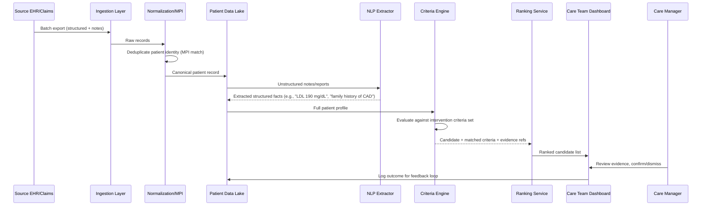

# Qualified Health — Identifying Patients for Life-Saving Treatments

## 1. Overview

| | |
|---|---|
| **Vendor / Deployer** | Qualified Health |
| **Problem** | Patients eligible for evidence-based, life-saving interventions go unidentified because relevant clinical evidence is scattered across fragmented medical records (multiple EHRs, unstructured notes, labs, imaging reports). |
| **Solution** | A system that screens large patient populations against fragmented records to surface candidates for specific evidence-based interventions (e.g., statin eligibility, cancer screening, genetic testing referral). |
| **Reported Outcome** | Increased identification of patients who qualify for interventions that would otherwise be missed. |
| **Primary Users** | Population health teams, care managers, specialist referral coordinators. |

> **Disclaimer:** This is an illustrative, inferred architecture based on common patterns for population-scale clinical NLP / cohort-identification systems — not a disclosure of Qualified Health's actual internal design.

---

## 2. High-Level Design (HLD)

### 2.1 System Context Diagram

```mermaid
flowchart LR
    EHR1[(EHR System A)]
    EHR2[(EHR System B)]
    Claims[(Claims / Labs Feed)]
    Ingest[Multi-Source Ingestion Layer]
    Norm[Normalization &\nEntity Resolution]
    Store[(Unified Patient\nData Lake)]
    NLP[Clinical NLP /\nUnstructured Text Extractor]
    Rules[Criteria Engine\n(rules + LLM reasoning)]
    Rank[Candidate Ranking Service]
    Dash[Care Team Dashboard]
    CareTeam[Care Manager / Specialist]

    EHR1 --> Ingest
    EHR2 --> Ingest
    Claims --> Ingest
    Ingest --> Norm
    Norm --> Store
    Store --> NLP
    NLP --> Store
    Store --> Rules
    Rules --> Rank
    Rank --> Dash
    Dash --> CareTeam
    CareTeam -->|Confirms / dismisses candidate| Rank
```

### 2.2 Component Overview

| Component | Responsibility | Key Tech Choice |
|---|---|---|
| Multi-Source Ingestion Layer | Pulls structured + unstructured data from disparate EHRs and claims feeds | HL7v2/FHIR interfaces, batch ETL, SFTP for claims |
| Normalization & Entity Resolution | Deduplicates patients across sources, maps codes to common terminologies | Master Patient Index (MPI), terminology mapping (LOINC/RxNorm/ICD-10) |
| Unified Patient Data Lake | Canonical longitudinal patient record | Data lake / warehouse (columnar storage) |
| Clinical NLP Extractor | Extracts structured facts from unstructured notes/reports | NLP pipeline + LLM-based extraction |
| Criteria Engine | Evaluates each patient against intervention eligibility criteria | Rules engine + LLM reasoning over evidence |
| Candidate Ranking Service | Prioritizes candidates by confidence/urgency | Scoring service |
| Care Team Dashboard | Surfaces ranked candidates with supporting evidence | Web app |

### 2.3 Non-Functional Requirements

- **Compliance:** HIPAA; data-sharing agreements/BAAs across every source EHR; de-identification where possible for bulk analysis.
- **Data Fragmentation Handling:** Must tolerate inconsistent coding systems, missing fields, and duplicate patient identities across sources.
- **Explainability:** Every surfaced candidate must show the underlying evidence (source documents/fields) that drove the match, for clinician trust and audit.
- **Throughput:** Designed for population-scale batch screening (potentially millions of patient records) rather than single-encounter real-time use.
- **Accuracy/Precision:** Bias toward high precision on "no false reassurance" — missed true positives are the primary risk to mitigate, but false positives create alert fatigue.

---

## 3. Low-Level Design (LLD)

### 3.1 Data Flow — "Population Screening Run"



### 3.2 Key Data Models

```
PatientMasterRecord
  patient_uuid: UUID
  source_ids: [{source_system, source_patient_id}]
  demographics: {dob, sex, ...}
  last_updated: timestamp

ClinicalFact
  id: UUID
  patient_uuid: UUID (FK)
  fact_type: enum [lab, diagnosis, medication, family_history, imaging_finding]
  code: string (LOINC/ICD-10/RxNorm)
  value: string
  source_document_id: UUID
  extracted_by: enum [structured_field, nlp_extraction]
  confidence: float

InterventionCriteria
  id: UUID
  intervention_name: string
  criteria_logic: JSON (rule tree / LLM prompt spec)
  version: int

ScreeningCandidate
  id: UUID
  patient_uuid: UUID (FK)
  intervention_id: UUID (FK)
  matched_facts: [ClinicalFact.id]
  confidence_score: float
  status: enum [pending_review, confirmed, dismissed]
  reviewed_by: string
  reviewed_at: timestamp
```

### 3.3 Representative API Surface

| Method | Path | Purpose |
|---|---|---|
| POST | `/v1/ingestion/batches` | Register a new batch of source data for processing |
| GET | `/v1/patients/{uuid}/facts` | Retrieve normalized clinical facts for a patient |
| POST | `/v1/screening-runs` | Trigger a screening run for a given intervention against a population |
| GET | `/v1/screening-runs/{id}/candidates` | List ranked candidates from a run |
| GET | `/v1/candidates/{id}/evidence` | Retrieve supporting evidence for a candidate |
| PUT | `/v1/candidates/{id}/review` | Care manager confirms/dismisses a candidate |

### 3.4 Tech Stack by Layer

| Layer | Stack |
|---|---|
| Ingestion | HL7v2/FHIR adapters, batch ETL (Airflow/dbt), SFTP for claims |
| Identity Resolution | MPI / probabilistic matching service |
| Storage | Data lake (e.g., columnar object storage) + warehouse for query |
| NLP/Extraction | Clinical NLP pipeline + LLM-based extraction with terminology grounding |
| Criteria Evaluation | Rules engine (versioned criteria) combined with LLM reasoning for nuanced criteria |
| Ranking | Scoring microservice, feature store for confidence signals |
| Frontend | Web dashboard with evidence drill-down |
| Compliance | Data governance layer, audit logging, de-identification pipeline |

### 3.5 Key Processing Steps

1. Resolve patient identity across sources before any clinical reasoning (fragmentation is a data-quality problem first, an ML problem second).
2. Extract structured facts from unstructured notes using NLP/LLM, always retaining a pointer back to the source document for evidence.
3. Evaluate versioned, auditable criteria (not a black-box score alone) so clinical teams can trust and explain each match.
4. Rank candidates by confidence and clinical urgency, not just raw match count.
5. Feed reviewer confirm/dismiss decisions back into the pipeline to refine criteria and reduce false positives over time.
