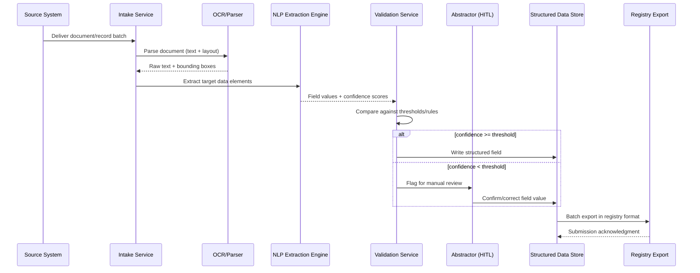

# Carta Healthcare — 66% Faster Clinical Data Processing

## 1. Overview

| | |
|---|---|
| **Vendor / Deployer** | Carta Healthcare |
| **Problem** | Clinical registries and quality programs require extracting and structuring huge volumes of data from health records (charts, scanned documents, structured EHR fields) — traditionally slow, manual abstraction work. |
| **Solution** | Automates extraction and structuring of clinical data from health records while maintaining high (99%) accuracy. |
| **Reported Outcome** | 66% faster clinical data processing vs. manual abstraction, at ~99% accuracy. |
| **Primary Users** | Clinical data abstractors, registry teams, quality/compliance programs. |

> **Disclaimer:** Illustrative, inferred architecture based on common patterns for clinical document extraction / data-abstraction automation systems — not a disclosure of Carta Healthcare's actual internal design.

---

## 2. High-Level Design (HLD)

### 2.1 System Context Diagram

```mermaid
flowchart LR
    Docs[Source Documents\n(EHR exports, scans, PDFs)]
    Intake[Document Intake Service]
    OCR[OCR / Document Parsing]
    NLP[Clinical NLP Extraction Engine]
    Val[Validation & Confidence Scoring]
    HITL[Human-in-the-Loop\nAbstractor Review]
    Struct[(Structured Data Store)]
    Export[Export / Registry Integration]
    Registry[(Quality Registry /\nDownstream System)]

    Docs --> Intake
    Intake --> OCR
    OCR --> NLP
    NLP --> Val
    Val -->|High confidence| Struct
    Val -->|Low confidence| HITL
    HITL --> Struct
    Struct --> Export
    Export --> Registry
```

### 2.2 Component Overview

| Component | Responsibility | Key Tech Choice |
|---|---|---|
| Document Intake Service | Receives and queues incoming records for processing | Batch/event-driven ingestion, file/queue-based |
| OCR / Document Parsing | Converts scanned/PDF documents into machine-readable text + layout | OCR engine with layout/table detection |
| Clinical NLP Extraction Engine | Extracts target data elements (diagnoses, measures, dates, values) into structured fields | NLP pipeline + LLM-assisted field extraction |
| Validation & Confidence Scoring | Scores extraction confidence, flags fields below threshold | Rule-based validators + model confidence scores |
| Human-in-the-Loop Review | Abstractors verify/correct low-confidence extractions | Review UI with side-by-side source/extraction view |
| Structured Data Store | Canonical structured output | Relational DB / data warehouse |
| Export / Registry Integration | Formats and submits data to downstream registries | Registry-specific export adapters (e.g., NCDR-style formats) |

### 2.3 Non-Functional Requirements

- **Accuracy target:** ~99% field-level accuracy — drives the human-in-the-loop confidence-threshold design.
- **Throughput:** Must process high document volume substantially faster than manual abstraction (66% time reduction target).
- **Auditability:** Every structured field must be traceable back to its source document/location for compliance and registry submission.
- **Compliance:** HIPAA; registry-specific data submission standards.
- **Scalability:** Horizontally scalable extraction workers to handle backlog spikes (e.g., quarterly registry deadlines).

---

## 3. Low-Level Design (LLD)

### 3.1 Data Flow — "Document to Registry-Ready Record"



### 3.2 Key Data Models

```
SourceDocument
  id: UUID
  patient_ref: string
  document_type: enum [scanned_pdf, ehr_export, structured_field]
  received_at: timestamp
  storage_path: string

ExtractedField
  id: UUID
  document_id: UUID (FK)
  field_name: string  (e.g., "ejection_fraction", "procedure_date")
  raw_value: string
  normalized_value: string
  confidence_score: float
  source_location: {page, bbox}
  status: enum [auto_accepted, needs_review, human_verified]

AbstractionTask
  id: UUID
  extracted_field_id: UUID (FK)
  assigned_to: string
  original_value: string
  corrected_value: string
  reviewed_at: timestamp

RegistryRecord
  id: UUID
  patient_ref: string
  registry_name: string
  field_set: JSON (mapped ExtractedField values)
  submitted_at: timestamp
  submission_status: enum [pending, accepted, rejected]
```

### 3.3 Representative API Surface

| Method | Path | Purpose |
|---|---|---|
| POST | `/v1/documents` | Submit a new document/record for processing |
| GET | `/v1/documents/{id}/extraction` | Retrieve extracted fields + confidence scores |
| GET | `/v1/review-queue` | List fields flagged for human review |
| PUT | `/v1/review-queue/{field_id}` | Submit abstractor correction/confirmation |
| POST | `/v1/registries/{name}/export` | Trigger batch export to a target registry |
| GET | `/v1/registries/{name}/submissions/{id}` | Check submission status |

### 3.4 Tech Stack by Layer

| Layer | Stack |
|---|---|
| Intake | Queue-based ingestion (SQS/Kafka), object storage for raw docs |
| OCR/Parsing | OCR engine with table/layout detection |
| Extraction | NLP pipeline + LLM-assisted extraction with domain-specific field schemas |
| Validation | Rule-based validators, per-field confidence thresholds |
| Review UI | Web app with source-document viewer + inline field editing |
| Storage | Relational DB for structured records, object storage for source docs |
| Export | Registry-specific format adapters (batch jobs) |
| Observability | Extraction accuracy dashboards, per-field error tracking |

### 3.5 Key Processing Steps

1. Parse documents preserving layout/location so every extracted field can cite its exact source location (critical for the review UI and audit trail).
2. Extract fields against a defined schema per registry/use case rather than free-form extraction, enabling consistent downstream mapping.
3. Score confidence per field and route only low-confidence fields to human abstractors — this selective review is what enables both speed (66% faster) and accuracy (99%) simultaneously.
4. Feed abstractor corrections back as training/calibration signal to improve future confidence scoring and reduce review volume over time.
5. Maintain full field-to-source traceability for registry audit and compliance requirements.
