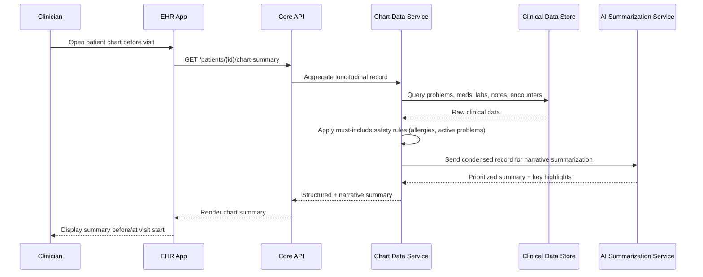

# Elation Health — 61% Less Time on Chart Review

## 1. Overview

| | |
|---|---|
| **Vendor / Deployer** | Elation Health |
| **Problem** | Primary-care clinicians spend excessive time reviewing patient charts and documenting visits within their EHR, cutting into time with patients. |
| **Solution** | A primary-care EHR platform with AI-assisted chart review and documentation features built into the core clinical workflow. |
| **Reported Outcome** | 61% reduction in time spent on chart review and documentation. |
| **Primary Users** | Primary-care physicians and their care teams. |

> **Disclaimer:** Illustrative, inferred architecture based on common patterns for AI-assisted EHR platforms — not a disclosure of Elation Health's actual internal design.

---

## 2. High-Level Design (HLD)

Unlike the other case studies (which are typically an add-on layer to an existing EHR), Elation Health *is* the EHR platform itself, with AI-assisted chart review/documentation as a native feature.

### 2.1 System Context Diagram

```mermaid
flowchart LR
    Clinician[Primary Care Clinician]
    App[Elation EHR Web/Desktop App]
    API[Core EHR API Layer]
    ChartSvc[Chart Data Service]
    AISumm[AI Chart Summarization Service]
    DocSvc[Documentation Assist Service]
    DB[(Clinical Data Store\nEncounters, Labs, Meds, Notes)]
    Interop[Interoperability Layer\n(FHIR / HIE / Labs feeds)]
    External[(External Labs, Pharmacies,\nHIEs, Referral Partners)]

    Clinician --> App
    App --> API
    API --> ChartSvc
    ChartSvc --> DB
    ChartSvc --> AISumm
    AISumm --> App
    API --> DocSvc
    DocSvc --> DB
    DocSvc --> AISumm
    Interop --> External
    Interop --> DB
```

### 2.2 Component Overview

| Component | Responsibility | Key Tech Choice |
|---|---|---|
| Core EHR API Layer | Central API for all clinical data access/mutation | RESTful/GraphQL API over clinical data model |
| Chart Data Service | Aggregates a patient's longitudinal chart (problems, meds, labs, encounters, notes) | Query/aggregation service over clinical DB |
| AI Chart Summarization Service | Produces concise, prioritized summaries of chart data for pre-visit/at-visit review | LLM-based summarization with clinical prompt templates |
| Documentation Assist Service | Assists with note drafting/auto-fill during and after the visit | LLM-based drafting, template-driven |
| Clinical Data Store | System-of-record for all clinical data | Relational DB with clinical data model (problems, meds, labs, notes) |
| Interoperability Layer | Exchanges data with labs, pharmacies, HIEs, referral partners | HL7 FHIR, HL7v2, direct interfaces |

### 2.3 Non-Functional Requirements

- **Compliance:** HIPAA, ONC certification requirements for certified EHR technology (interoperability, audit logging, patient access).
- **In-workflow latency:** Chart summaries must render fast enough to be usable during a live visit (sub-second to a few seconds).
- **Accuracy/Safety:** Summarization must not omit safety-critical data (allergies, active problems, recent abnormal labs) — requires deterministic "must-include" rules layered with LLM summarization, not summarization alone.
- **Availability:** Core EHR must meet high-availability SLAs since it's the system of record, not just an assistive add-on.
- **Data completeness:** As a full EHR, must reconcile data arriving continuously from external labs/pharmacies/HIEs, not just data it generates itself.

---

## 3. Low-Level Design (LLD)

### 3.1 Data Flow — "Pre-Visit Chart Review"



### 3.2 Key Data Models

```
Patient
  id: UUID
  demographics: {...}
  problem_list: [ProblemEntry]
  allergies: [AllergyEntry]

Encounter
  id: UUID
  patient_id: UUID (FK)
  date: date
  provider_id: string
  note_id: UUID (FK, nullable)

ClinicalNote
  id: UUID
  encounter_id: UUID (FK)
  content: text
  ai_assisted: boolean
  last_edited_by: string

ChartSummary  (ephemeral / cached, not system-of-record)
  patient_id: UUID (FK)
  generated_at: timestamp
  must_include_items: [string]   -- deterministic safety-critical items
  ai_summary_text: string
  source_data_refs: [record ids used]

LabResult
  id: UUID
  patient_id: UUID (FK)
  test_code: string (LOINC)
  value: string
  flagged_abnormal: boolean
  received_at: timestamp
```

### 3.3 Representative API Surface

| Method | Path | Purpose |
|---|---|---|
| GET | `/v1/patients/{id}/chart-summary` | Retrieve AI-assisted pre-visit chart summary |
| GET | `/v1/patients/{id}/problems` | Retrieve structured problem list |
| POST | `/v1/encounters/{id}/notes/draft` | Generate documentation-assist draft for an encounter |
| PUT | `/v1/encounters/{id}/notes` | Save clinician-finalized note |
| GET | `/v1/patients/{id}/labs?flagged=true` | Retrieve flagged abnormal labs |
| POST | `/v1/interop/labs/inbound` | Receive inbound lab result feed (HL7/FHIR) |

### 3.4 Tech Stack by Layer

| Layer | Stack |
|---|---|
| Core EHR API | REST/GraphQL API over clinical data model, certified for ONC interoperability |
| Clinical Data Store | Relational DB modeling problems/meds/labs/encounters/notes |
| AI Summarization | LLM-based service with deterministic safety-rule pre/post-processing |
| Documentation Assist | LLM-based drafting integrated into note editor |
| Interoperability | HL7 FHIR R4, HL7v2 interfaces to labs/pharmacies/HIEs |
| Frontend | Web/desktop clinical application (chart view, note editor) |
| Compliance | Audit logging, access controls per ONC/HIPAA certification requirements |

### 3.5 Key Processing Steps

1. Separate deterministic "must-include" safety data (allergies, active problems, abnormal labs) from LLM-generated narrative summary — safety data is never left to summarization alone.
2. Cache/refresh chart summaries on data change (new lab result, new note) rather than regenerating on every view, balancing freshness with latency.
3. Documentation-assist drafts are generated from structured encounter data and prior note templates, then handed to the clinician for edit — the 61% time reduction comes from cutting first-draft effort, not eliminating clinician review.
4. Reconcile continuously arriving external data (labs, pharmacy fills, HIE records) into the canonical chart before summarization runs, so summaries reflect the most current state.
