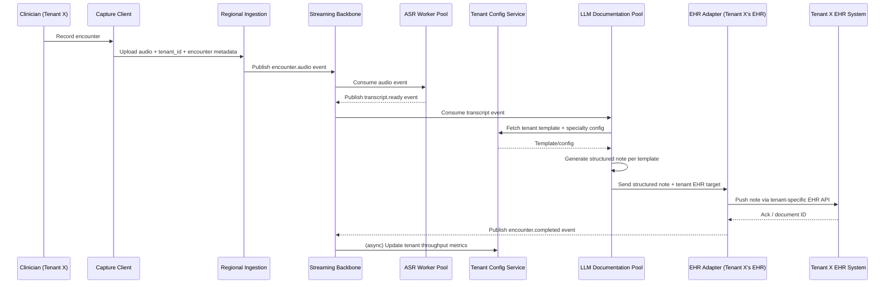

# Commure — Clinical Documentation Automation at Scale

## 1. Overview

| | |
|---|---|
| **Vendor / Deployer** | Commure |
| **Problem** | Clinical documentation generated during patient encounters is time-consuming to produce manually, at a scale spanning many health systems and EHRs. |
| **Solution** | Automates clinical documentation generation directly from patient encounters (ambient capture), integrating across multiple EHR systems at scale. |
| **Reported Outcome** | Saves clinicians millions of hours in aggregate across deployments. |
| **Primary Users** | Clinicians across many health systems/EHR platforms (multi-tenant deployment). |

> **Disclaimer:** Illustrative, inferred architecture based on common patterns for multi-tenant ambient clinical documentation platforms — not a disclosure of Commure's actual internal design.

---

## 2. High-Level Design (HLD)

The distinguishing architectural challenge for Commure (vs. a single-health-system deployment like Banner Health) is **multi-tenant scale**: many health systems, many EHR types, high aggregate encounter volume.

### 2.1 System Context Diagram

```mermaid
flowchart LR
    Clin[Clinicians\n(many health systems)]
    Cap[Ambient Capture Clients]
    Edge[Edge/Regional Ingestion]
    Queue[Event Streaming Backbone]
    ASR[ASR Service Pool]
    LLM[LLM Documentation Service Pool]
    Tenant[Tenant Config &\nTemplate Service]
    EHRAdapters[EHR Adapter Layer\n(Epic, Cerner, athenahealth, ...)]
    EHRs[(Multiple EHR Systems)]
    Store[(Multi-Tenant\nEncounter Store)]
    Monitor[Scale/Quality Monitoring]

    Clin --> Cap
    Cap --> Edge
    Edge --> Queue
    Queue --> ASR
    ASR --> Queue
    Queue --> LLM
    Tenant --> LLM
    LLM --> Store
    LLM --> EHRAdapters
    EHRAdapters --> EHRs
    Queue --> Monitor
    LLM --> Monitor
```

### 2.2 Component Overview

| Component | Responsibility | Key Tech Choice |
|---|---|---|
| Ambient Capture Clients | Capture encounter audio across many care settings | Cross-platform capture SDK |
| Edge/Regional Ingestion | Regional intake points to reduce latency and meet data-residency needs | Regional ingestion services |
| Event Streaming Backbone | Decouples capture from processing at high throughput | Kafka/managed streaming platform |
| ASR Service Pool | Horizontally scaled transcription workers | Auto-scaled ASR model pool |
| LLM Documentation Service Pool | Generates structured notes per tenant's template/specialty | Auto-scaled LLM inference pool, per-tenant prompt configs |
| Tenant Config & Template Service | Stores per-health-system note templates, specialty configs, EHR mapping | Config service |
| EHR Adapter Layer | Normalizes integration across many different EHR vendors | Adapter-per-EHR-vendor pattern (Epic, Cerner, athenahealth, etc.) |
| Multi-Tenant Encounter Store | Isolated storage per tenant | Partitioned/sharded data store with tenant isolation |
| Scale/Quality Monitoring | Tracks throughput, latency, and note-quality metrics across tenants | Observability platform |

### 2.3 Non-Functional Requirements

- **Multi-tenancy:** Strict data isolation between health-system tenants; per-tenant configuration (templates, EHR target, specialty vocabulary).
- **Scale:** Must handle very high aggregate encounter volume across many simultaneous health systems (the "millions of hours saved" claim implies large aggregate throughput).
- **EHR heterogeneity:** Adapter layer must abstract differences across many EHR vendors' APIs/data models (FHIR maturity varies by vendor).
- **Compliance:** HIPAA plus per-tenant BAAs; some tenants may require data residency or private-cloud deployment.
- **Elasticity:** Auto-scaling of ASR/LLM inference pools to handle daily/weekly load patterns (e.g., clinic-hours peaks) across many time zones.

---

## 3. Low-Level Design (LLD)

### 3.1 Data Flow — "Multi-Tenant Encounter to EHR Note"



### 3.2 Key Data Models

```
Tenant
  id: UUID
  health_system_name: string
  ehr_vendor: enum [epic, cerner, athenahealth, other]
  data_residency_region: string
  note_templates: [TemplateRef]

Encounter
  id: UUID
  tenant_id: UUID (FK)   -- tenant isolation key on every core record
  clinician_id: string
  specialty: string
  started_at: timestamp
  status: enum [capturing, transcribing, drafting, delivered]

Transcript
  id: UUID
  encounter_id: UUID (FK)
  tenant_id: UUID (FK)
  text: string
  asr_worker_id: string
  latency_ms: int

NoteTemplate
  id: UUID
  tenant_id: UUID (FK)
  specialty: string
  section_schema: JSON

GeneratedNote
  id: UUID
  encounter_id: UUID (FK)
  tenant_id: UUID (FK)
  content_sections: JSON
  ehr_document_id: string (nullable, set after delivery)
  delivered_at: timestamp
```

### 3.3 Representative API Surface

| Method | Path | Purpose |
|---|---|---|
| POST | `/v1/tenants/{tenant_id}/encounters` | Register a new encounter for a tenant |
| POST | `/v1/tenants/{tenant_id}/encounters/{id}/audio` | Upload/stream encounter audio |
| GET | `/v1/tenants/{tenant_id}/encounters/{id}/note` | Retrieve generated note status/content |
| PUT | `/v1/tenants/{tenant_id}/templates/{specialty}` | Configure/update a tenant's note template |
| POST | `/v1/tenants/{tenant_id}/encounters/{id}/deliver` | Push finalized note to tenant's EHR |
| GET | `/v1/tenants/{tenant_id}/metrics/throughput` | Retrieve tenant-level processing/throughput metrics |

### 3.4 Tech Stack by Layer

| Layer | Stack |
|---|---|
| Capture | Cross-platform ambient capture SDK |
| Ingestion/Streaming | Regional ingestion + Kafka/managed streaming backbone |
| ASR | Auto-scaled transcription worker pool |
| LLM Documentation | Auto-scaled LLM inference pool with per-tenant prompt/template injection |
| Tenant Config | Config service backing per-tenant templates and EHR routing |
| EHR Integration | Adapter-per-vendor layer (FHIR where available, vendor-specific APIs otherwise) |
| Storage | Sharded/partitioned multi-tenant data store, per-tenant encryption keys |
| Observability | Cross-tenant throughput, latency, and note-quality monitoring |

### 3.5 Key Processing Steps

1. Tag every record with `tenant_id` from ingestion onward, enforcing isolation at the storage and processing layers, not just at the API edge.
2. Decouple ASR and LLM stages via an event streaming backbone so each stage scales independently to absorb load spikes from any single tenant without affecting others.
3. Resolve tenant-specific note templates and specialty vocabulary at generation time so one shared LLM service pool can serve heterogeneous health systems.
4. Abstract EHR differences behind a per-vendor adapter layer so the documentation pipeline itself stays EHR-agnostic.
5. Track per-tenant throughput/latency/quality metrics to detect degradation for any individual health system within the shared multi-tenant platform.
